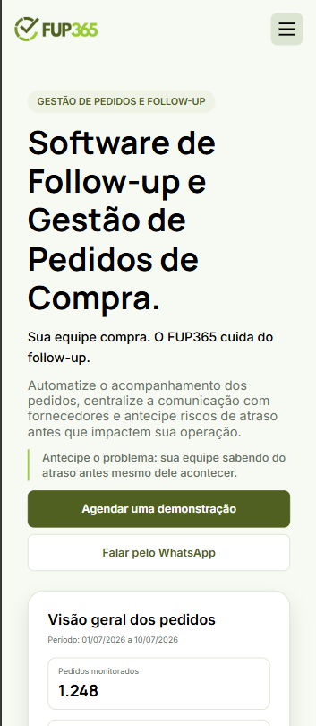

# FUP365 — Landing Page

Landing page institucional do FUP365, plataforma voltada à gestão de pedidos de compra e automação do follow-up com fornecedores.

**Produção:** https://www.fup365.com.br/site/


## Sobre o projeto

A landing page foi desenvolvida para apresentar o FUP365 de forma mais clara e objetiva, aproximando a comunicação do site da operação da plataforma.

O projeto apresenta o funcionamento da solução, modalidades de operação, resultados, clientes, depoimentos e canais comerciais em uma interface responsiva para desktop, tablet e mobile.

Além da construção visual, o desenvolvimento envolveu decisões relacionadas a arquitetura, acessibilidade, performance, SEO técnico e publicação em hospedagem estática.

## Interface

A interface foi construída para apresentar o produto com clareza, mantendo a linguagem visual alinhada a uma solução B2B e preservando a experiência entre diferentes tamanhos de tela.

### Desktop


### Mobile



## Tecnologias

- HTML5
- CSS3
- TypeScript
- Vite
- Git e GitHub
- ESLint
- Prettier
- Fontsource

Integrações utilizadas:

- Microsoft Bookings
- WhatsApp
- E-mail corporativo

## Estrutura

O código foi separado por responsabilidade:

```text
src/
├── components/   # Seções e componentes da interface
├── config/       # Configurações e links externos
├── data/         # Conteúdo estruturado
├── scripts/      # Interações e comportamentos
├── styles/       # Estilos globais e por componente
├── types/        # Tipagens compartilhadas
├── app.ts        # Composição da landing page
└── main.ts       # Inicialização da aplicação
```

## Responsividade

A interface foi desenvolvida e validada em diferentes tamanhos de tela, incluindo:

- mobile a partir de 360px;
- tablets;
- notebooks;
- desktops.

O layout adapta organização, espaçamentos e algumas interações de acordo com o espaço disponível, preservando o conteúdo e a hierarquia visual da página.

## Interações

O JavaScript complementa a experiência da landing page com comportamentos como:

- navegação responsiva e menu mobile;
- progressão de conteúdo baseada em scroll;
- etapas interativas na seção "Como funciona";
- transições e animações;
- navegação preparada para múltiplos depoimentos.

As animações também respeitam a preferência `prefers-reduced-motion`.

## Pré-renderização

Durante o desenvolvimento, o Vite utiliza o `index.html` como ponto de entrada e os módulos TypeScript constroem a aplicação.

Na build de produção, o conteúdo principal da landing page também é pré-renderizado e inserido diretamente no HTML final.

Com isso, a estrutura e o conteúdo institucional permanecem disponíveis mesmo sem a execução do JavaScript. Os scripts ficam responsáveis principalmente pelas interações e comportamentos progressivos da interface.

## Build e publicação

O Vite é utilizado como ferramenta de desenvolvimento e build.

A versão de produção é gerada no diretório:

```text
dist/
```

O resultado final é composto por arquivos estáticos, sem necessidade de Node.js, PHP ou outro runtime da aplicação no servidor.

Os assets utilizam caminhos relativos, permitindo que a mesma build seja publicada tanto na raiz de um domínio quanto em um subdiretório.

## Qualidade

Antes de uma versão ser considerada válida, o projeto executa:

```bash
npm run check
```

Esse comando reúne:

- verificação de tipos com TypeScript;
- análise estática com ESLint;
- validação de formatação com Prettier;
- build de produção.

Também foram realizados testes de:

- responsividade;
- navegação por teclado;
- estados de foco;
- preferência por redução de movimento;
- carregamento de assets;
- links externos;
- funcionamento do conteúdo sem JavaScript;
- publicação em subdiretórios;
- performance;
- acessibilidade;
- SEO técnico.

## Status

Projeto publicado e em uso:

https://www.fup365.com.br/site/

O repositório mantém o código-fonte e a documentação da versão desenvolvida para a landing page do FUP365.
